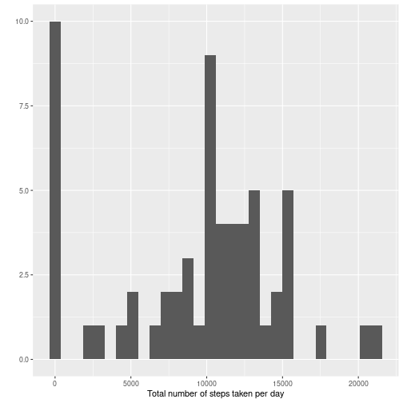

## Packages

```r
library(dplyr)
library(lubridate)
library(ggplot2)
```

## Loading and preprocessing the data
As a first step, we have to `unzip()` the zip file 'activity.zip'. After unzipping,
we can look at the data in the folder with the `dir()` command.


```r
unzip("activity.zip")
dir()
```

```
## [1] "activity.csv"           "activity.zip"           "Course project 1.Rproj" "PA1_template.Rmd"
```

Now, we can load the data from the csv file 'activity.csv' into the variable
called `df_raw`. After loading the data, we have a first look at the data.

```r
df_raw <- read.csv("activity.csv")
head(df_raw)
```

```
##   steps       date interval
## 1    NA 2012-10-01        0
## 2    NA 2012-10-01        5
## 3    NA 2012-10-01       10
## 4    NA 2012-10-01       15
## 5    NA 2012-10-01       20
## 6    NA 2012-10-01       25
```

We note that there are missing values in the column steps. The date column still
needs to be transformed into a date format. We call the processed data.frame
`dfm` (*m* for missing values).

```r
dfm <- df_raw %>%
    mutate(date = ymd(date))
```

## Mean total number of steps taken per day
In order to calculate the total number of steps per day, we have to aggregate 
the data by day (sum over all intervals of a given day). We do this by grouping
by `date` and summing up the `steps`. Note that since `steps` includes missing
values, we have to use the option `na.rm = TRUE` when applying the sum. 

We call the daily data frame `dfm_daily`.

```r
dfm_daily <- dfm %>%
    group_by(date) %>%
    summarise(totalsteps = sum(steps, na.rm = TRUE))
```

Now we make a histogram of the total steps per day.

```r
qplot(dfm_daily$totalsteps, xlab="Total number of steps taken per day")
```

```
## `stat_bin()` using `bins = 30`. Pick better value with `binwidth`.
```



We can easily compute the mean and median of `totalsteps`.

```r
mean(dfm_daily$totalsteps, na.rm = TRUE)
```

```
## [1] 9354.23
```

```r
median(dfm_daily$totalsteps, na.rm = TRUE)
```

```
## [1] 10395
```

## Average daily activity pattern
This question asks us to look at the average behaviour per 5-minute interval 
across all days. We therefore have to apply a different grouping.

```r
dfm_interval <- dfm %>%
    group_by(interval) %>%
    summarise(avgsteps = mean(steps, na.rm = TRUE))
qplot(dfm_interval$interval, dfm_interval$avgsteps, geom="line", 
      xlab="Interval", ylab="Average steps across days")
```


In order to find the interval with the maximum number of average steps we use
the function `which.max()`. This function gives us the index of the maximum 
value. We can then use the index to get the interval.

```r
dfm_interval$interval[which.max(dfm_interval$avgsteps)]
```

```
## [1] 835
```
## Imputing missing values
To calculate the missing values we apply the `is.na()` function and then take 
the `sum()`, as R interprets `TRUE` as 1 and `FALSE` as 0.

```r
sum(is.na(dfm$steps))
```

```
## [1] 2304
```
In order to fill the missing values, I will use the mean value of the respecitve 
interval. Note that the data frame `dfm_interval` already contains all possible
filling values. So, we replace the `NA` values with the appropriate value and
call the resulting data frame `dfnm` (*nm* = no missing). 

To impute the missing values, I join the original data frame `dfm` with `dfm_interval`. 
In a second step I replace missing values. Finally, we only select the relevant
columns.

```r
dfnm <- left_join(dfm, dfm_interval, by=c("interval"))
dfnm$steps[is.na(dfnm$steps)] <- dfnm$avgsteps[is.na(dfnm$steps)]
dfnm <- dfnm %>% 
    select(steps, date, interval)
```

Now, create again the histogram and calculate mean and median of steps taken 
per day. 

```r
dfnm_daily <- dfnm %>%
    group_by(date) %>%
    summarise(totalsteps = sum(steps))

qplot(dfnm_daily$totalsteps, xlab="Total number of steps taken per day", 
      main="Histogram with imputed data set")
```

```
## `stat_bin()` using `bins = 30`. Pick better value with `binwidth`.
```


```r
mean(dfnm_daily$totalsteps)
```

```
## [1] 10766.19
```

```r
median(dfnm_daily$totalsteps)
```

```
## [1] 10766.19
```
The values differ from the original data set, both the mean and median are 
higher.

## Differences in activity patterns  between weekdays and weekends
First we create a new factor variable called weekday

```r
dfnm <- dfnm %>%
    mutate(weekdays = if_else(weekdays(date) == "Saturday" | weekdays(date) == "Sunday", "weekend", "weekday"),
           weekdays = as.factor(weekdays)
           )
dfnm_interval <- dfnm %>%
    group_by(interval, weekdays) %>%
    summarise(avgsteps = mean(steps))
```

```
## `summarise()` has grouped output by 'interval'. You can override using the `.groups` argument.
```
On to the plot.

```r
g <- ggplot(data = dfnm_interval, mapping = aes(x=interval, y=avgsteps))
g <- g + geom_line()
g <- g + facet_grid(. ~ weekdays)
g
```


